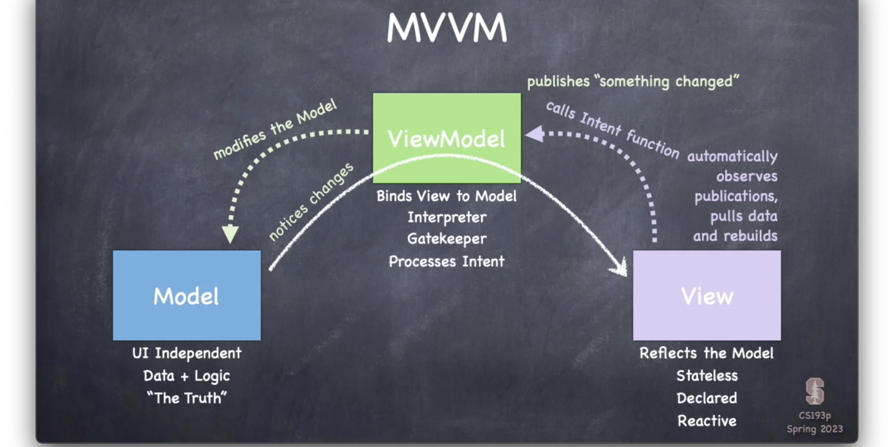
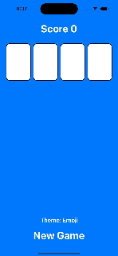

# Stanford CS193p Developing Apps for iOS

  

This is my very path through the [iOS development course](https://cs193p.sites.stanford.edu/2023). There are 15 lectures and 6 programming + 3 reading assignments.

Goals:

1. Complete this course from cover to cover.
2. Follow the codestyle.
3. Get familiar with CI and stuff.
4. Have fun.

Miniprojects that were created alongside this course:

1. TBD

## Lectures

| Lecture | Topic                          | Progress           |
| ------- | ------------------------------ | ------------------ |
| 1.      | Getting Started with SwiftUI   | :heavy_check_mark: |
| 2.      | More SwiftUI                   | :heavy_check_mark: |
| 3.      | MVVM                           | :heavy_check_mark: |
| 4.      | Applying MVVM                  | :heavy_check_mark: |
| 5.      | Protocols, enum, Optional      | :x:                |
| 6.      | Layout, @ViewBuilder           | :x:                |
| 7.      | Shape, ViewModifier, Constants | :x:                |
| 8.      | Animation (Part 1)             | :x:                |
| 9.      | Animation (Part 2)             | :x:                |
| 10.     | Emoji Art                      | :x:                |
| 11.     | Gestures, 2nd MVVM             | :x:                |
| 12.     | Persistence, Property Wrappers | :x:                |
| 13.     | Presenting Views, Navigation   | :x:                |
| 14.     | Multithreading, Error Handling | :x:                |
| 15.     | Document Architecture          | :x:                |

## Reading Assignments

| Reading | Name                                                                  | Progress           |
| ------- | --------------------------------------------------------------------- | ------------------ |
| 1.      | [Reading 1: Intro to Swift](<Reading-Assignment/Reading 1.pdf>)      | :heavy_check_mark: |
| 2.      | [Reading 2: More Swift](<Reading-Assignment/Reading 2.pdf>)          | :heavy_check_mark: |
| 3.      | [Reading 3: Finishing off Swift](<Reading-Assignment/Reading 3.pdf>) | :heavy_check_mark: |

## Programming Assignments

| PS  | Name                                                                       | Progress           |
| --- | -------------------------------------------------------------------------- | ------------------ |
| 1.  | [Assignment 1: Concentration](<Programming-Assignment/Programming 1.pdf>) | :heavy_check_mark: |
| 2.  | [Assignment 2: Set](<Programming-Assignment/Programming 2.pdf>)           | :heavy_check_mark: |
| 3.  | [Assignment 3: Graphical Set](<Programming-Assignment/Programming 3.pdf>) | :clock2:           |
| 4.  | [Assignment 4: Animated Set](<Programming-Assignment/Programming 1.pdf>)  | :x:                |
| 5.  | [Assignment 5: Image Gallery](<Programming-Assignment/Programming 2.pdf>) | :x:                |

### Programming Assignment 2

  

